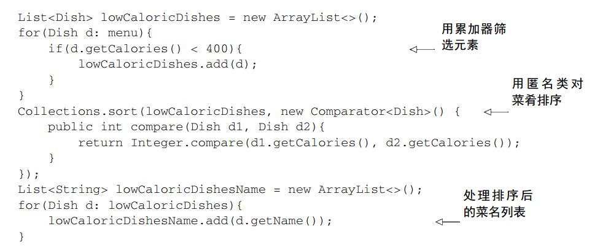
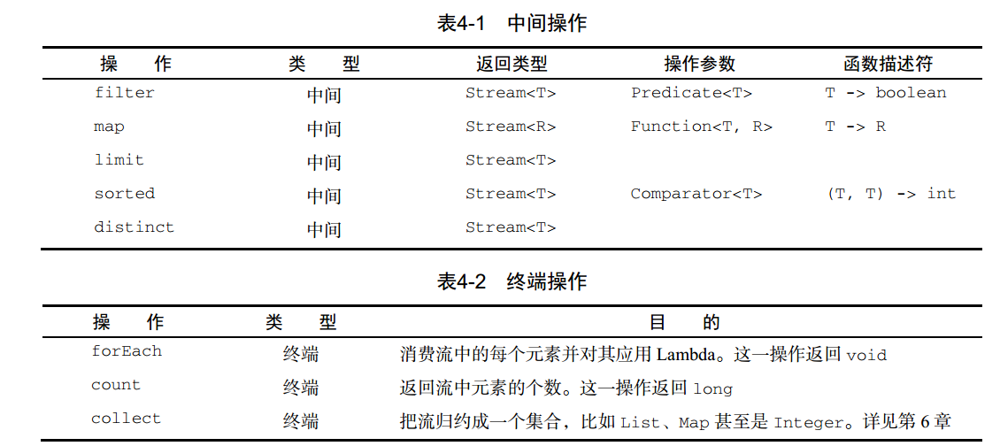
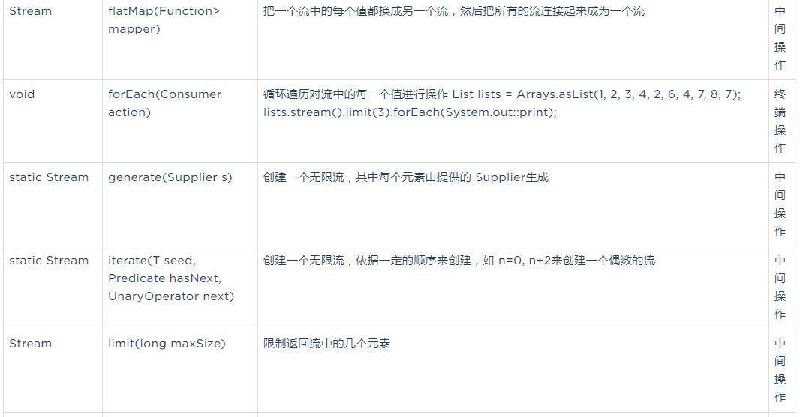
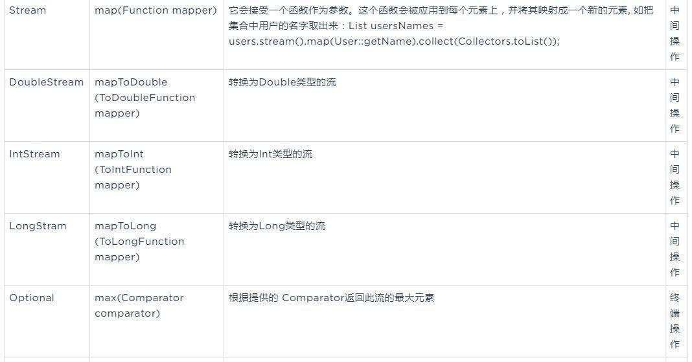
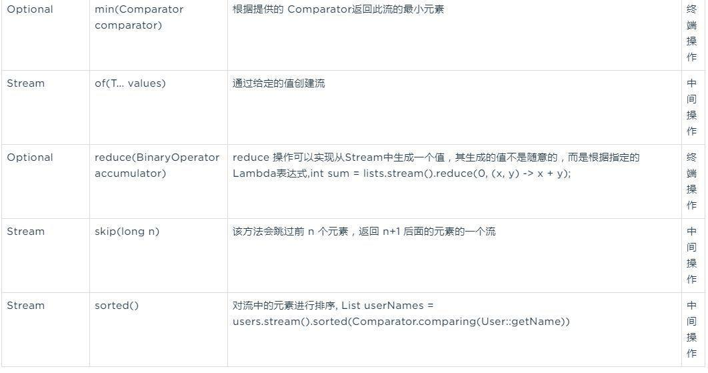

##    1、 什么是流？

​        流的定义是**从支持数据处理操作的源生成的元素序列**，流的目的在于**表达计算**，比如：filter、map、reduce、find、match、sort等。流操作有两个特点：

​      （1）流水线—很多流操作本身会返回一个流，这样多个操作就可以链接起来，形成一个流水线。

​      （2）内部迭代—与使用迭代器显示迭代的集合不同，流的迭代器操作是在背后进行的。

​     下面两端代码都是用来返回低热量的菜肴名称的，并按照卡路里排序，一个用Java7来写的，另一个是Java8的流写的。

​       

​        这段代码中有一个垃圾变量 lowCaloricDishes，它唯一的目的就是作一次性的中间容器。Java8只需要一行代码就可以实现上说的功能：

​        

​        新的方法实现有几个显而易见的好处：

​       （1）代码是以声明性方式写的，说明想要完成什么而不是如何实现一个操作。

​       （2）可以把几个基础操作链接起来，来表达复杂的数据处理流水线，同时保持代码清晰可读。

### 1.1、集合和流的差异？

​          集合是一个内存中的数据结构，它包含数据结构中目前所有的值—集合中的每个元素都得先算出来才能添加到集合中。流则是在概念上固定的数据结构，其元素是**按需计算**的。

​         

### 1.2、只能遍历一次

​        流只能遍历一次，遍历完之后，我们就说这个流已经被消费掉了。可以从原始数据源那里再获得一个新的流来重新遍历一遍。

## 2、如何使用流？

​       流的使用一般包括三件事：

​     （1）一个数据源来执行一个查询

​     （2）一个中间操作链，形成一条流的流水线

​     （3）一个终端操作，执行流水线，并能生成结果。

​       
  流的一些中间操作如图所示：      

​      
​      
​     
​     

## 3、并行数据处理与性能

###       3.1、什么是并行流？

​       **并行流**就是一个把内容分成多个数据块，并用不同的线程分别处理每个数据块的流。这样一来，就可以自动把给定操作的工作负荷分配给多个处理器的所有内核。

## 4、思考题

1、Map和FlatMap的区别？

2、并行流部分有时间深入研究下。

​	
