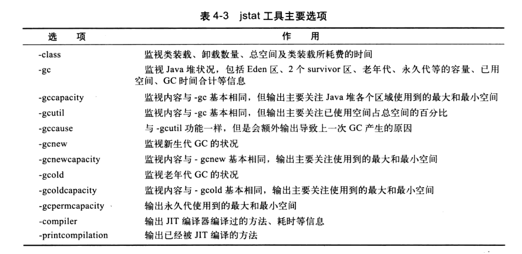
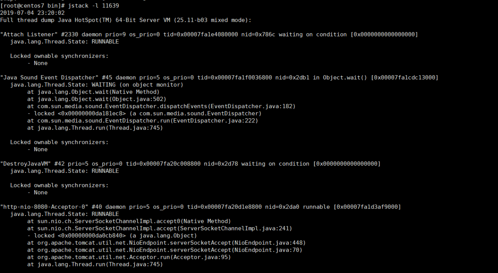

今天分享一下如何运用一些工具来定位问题和JVM有关的一些问题。

## 1、性能监控各种命令

### 1.1、jps

​        jps的作用：可以列出正在运行的虚拟机进程，并显示虚拟机执行**主类（main()函数所在的类）的名称**，以及这些进程的本地虚拟机的唯一ID。


### 1.2、jstat

​      jstat作用：用于监视虚拟机各种运行状态信息的命令行工具。它可以显示本地或远程虚拟机的类装载、内存、垃圾收集、JIT编译等运行数据。是性能分析**常用**的命令之一，查询的命令格式为：

​                            *jstat [ option vmid [interval[s|ms] [count]]]*

​      


​      其中，interval和count代表**查询间隔**和**次数**。假设我要每250毫秒查询一次进程垃圾收集状况，一共查询20次。

​       


​       


​    查询结果表明，这台服务器新生代Eden区（E代表Eden）使用了0.04%的空间。两个survivor分别占用了3.18%和0.0%的空间，老年代（O表示Old）和本地内存（M表示Metaspace）分别占用了50.28%和95 .16%。程序运行以来发生Minor GC共221338次，耗时526.523秒。发生Full GC共221次，耗时26.367秒。

### 1.3、jinfo

​     jinfo作用：实时地查看和调整虚拟机的各项参数。命令格式为：

​                         *jinfo [ option ] pid*

### 1.4、jmap

​         jmap作用：用于生成堆转储快照。命令格式：

​                         *jmap [ option ]  vmid*

​      


### 1.5、jhat

​          jhat作用：jhat内置了一个微型的HTTP/HTML服务器，生成dump文件分析结果后，可以在浏览器中查看。一般和jmap搭配用于分析jmap生成的堆转储快照。但是我们一般也**不会**用jhat来分析，原因有两个：1、一般不会在应用部署服务器上分析 。2、jhat的功能相对简陋。

### 1.6、jstack

​         jstack作用：用于生成虚拟机当前时刻的线程快照。*线程快照：当前虚拟机中每一条线程正在执行的方法堆栈集合，生成快照的目的是为了定位线程长时间停顿的原因。*  命令格式：

​                       *jstack [ option ]  vmid*

​        


   一般我们将jstack的结果重定向到一个文件中来详细的分析线程状态：

​       

根据进程号查看cpu占用情况

```shell
top -H -p 进程号

//可以得到就stack日志中的nid
printf "%x"  线程号 
```


## 2、思考题

1、jdk1.8之后不再有永久代，取而代之的是Metaspace本地内存，这两者有什么区别？

2、关于性能监控的一些可视化工具有空要学习一下。

### 
