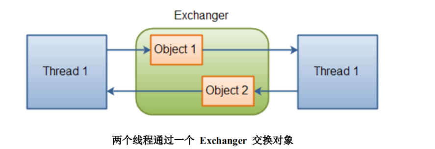

## 1、闭锁CountDownLatch

  java.util.concurrent.CountDownLatch 是一个并发构造，**它允许一个或多个线程等待一系列指定操作的完成**。 

CountDownLatch以一个给定的数量初始化。countDown()每被调用一次，这一数量就减一。通过调用await() 方法之一，线程可以阻塞等待这一数量到达零。

```java
package blockingqueue;

import java.util.concurrent.CountDownLatch;

public class CountDownLatchTest {
    static CountDownLatch countDownLatch = new CountDownLatch(2);

    public static void main(String[] args) throws InterruptedException {
        new Thread(() -> {
            System.out.println(1);
            countDownLatch.countDown();
            System.out.println(2);
            countDownLatch.countDown();
        }).start();
        countDownLatch.await();
        System.out.println(3);
    }
}

```

##  2、栅栏CyclicBarrier

   java.util.concurrent.CyclicBarrier 类是一种同步机制，它能够对处理一些算法的线程实现同步。换句话讲，它就是一个所有线程必须等待的一个栅栏，**直到所有线程都到达这里，然后所有线程才可以继续做其他事情。**


**创建一个CyclicBarrier** ：

   在创建一个 CyclicBarrier 的时候你需要定义有多少线程在被释放之前等待栅栏。创建CyclicBarrier 示例： 

   CyclicBarrier barrier = new CyclicBarrier(2);

以下演示了如何让一个线程等待一个 CyclicBarrier：barrier.await(); 当然，你也可以为等待线程设定一个超时时间。等待超过了超时时间之后，即便还没有达成N 个线程等待 CyclicBarrier 的条件，该线程也会被释放出来。以下是定义超时时间示例：

​    barrier.await(10, TimeUnit.SECONDS);

满足以下任何条件都可以让等待 CyclicBarrier 的线程释放： 

- 最后一个线程也到达 CyclicBarrier(调用 await()) 。
- 当前线程被其他线程打断(其他线程调用了这个线程的 interrupt() 方法) 。
- 其他等待栅栏的线程被打断 。
- 其他等待栅栏的线程因超时而被释放 。
- 外部线程调用了栅栏的 CyclicBarrier.reset() 方法。

```java
package blockingqueue;

import java.util.concurrent.CyclicBarrier;

public class CyclicBarrierTest {
    static CyclicBarrier cyclicBarrier = new CyclicBarrier(2);

    public static void main(String[] args) {

        new Thread(() -> {
            try {
                cyclicBarrier.await();
            } catch (Exception e) {
                e.printStackTrace();
            }
            System.out.println(1);
        }).start();

        try {
            cyclicBarrier.await();
        } catch (Exception e) {
            e.printStackTrace();
        }
        System.out.println(2);
    }
}

```

## 3、交换机Exchanger

​      Exchanger是一个用于线程间协作的工具类。**Exchanger用于线程间的数据交换**。它提供一个同步点，两个线程可以交换彼此的数据。这两个线程通过exchange方法交换数据，如果第一个线程先执行exchange方法，它会一直等待第二个线程也执行exchange方法，**当两个线程都到达同步点时，这两个线程就可以交换数据**，将本线程生产出来的数据传递给对方。




```java
public class ExchangerTest {
    static Exchanger exchanger = new Exchanger();

    public static void main(String[] args) {
        ExchangerRunnable exchangerRunnable1 =
                new ExchangerRunnable(exchanger, "A");
        ExchangerRunnable exchangerRunnable2 =
                new ExchangerRunnable(exchanger, "B");
        new Thread(exchangerRunnable1).start();
        new Thread(exchangerRunnable2).start();
    }
}

public class ExchangerRunnable implements Runnable {
    Exchanger exchanger = null;
    Object object = null;

    public ExchangerRunnable(Exchanger exchanger, Object object) {
        this.exchanger = exchanger;
        this.object = object;
    }

    public void run() {
        try {
            Object previous = this.object;
            this.object = this.exchanger.exchange(this.object);
            System.out.println(Thread.currentThread().getName() +
                            " exchanged " + previous + " for " + this.object
            );
        } catch (InterruptedException e) {
            e.printStackTrace();
        }
    }
}
```

## 4、信号量Semaphore

​    Semaphore是用来控制同时访问特定资源的线程数量，它通过协调各个线程，以保证合理的使用公共资源。

**应用场景：**

​    Semaphore可以用于做流量控制，比如数据库连接。假如有一个需求，要读取几万个文件的数据，因为都是IO密集型任务，我们可以启动几十个线程并发地读取，但是如果读到内存后，还需要存储到数据库中，而数据库的连接数只有10个，这时我们必须控制只有10个线程同时获取数据库连接保存数据，否则会报错无法获数据库连接。

```java
package blockingqueue;

import java.util.concurrent.ExecutorService;
import java.util.concurrent.Executors;
import java.util.concurrent.Semaphore;

public class SemaphoreTest {
    private static final int THREAD_COUNT = 30;

    private static ExecutorService threadpool = Executors.newFixedThreadPool(THREAD_COUNT);

    private static Semaphore s = new Semaphore(10);

    public static void main(String[] args) {
        for (int i = 0; i < THREAD_COUNT; i++) {
            threadpool.execute(new Runnable() {
                @Override
                public void run() {
                    try {
                        s.acquire();
                        System.out.println("save data");
                        s.release();
                    } catch (InterruptedException e) {
                        e.printStackTrace();
                    }
                }
            });
        }
        threadpool.shutdown();
    }
}

```

Semaphore的用法非常简单，首先线程使用Semaphore的acquire（）方法获取一个许可证，使用完之后调用release()方法归还许可证。

**其他方法：**

1. availablePermits()：返回此信号量中当前可用的许可证数。
2. getQueueLength()：返回正在等待获取许可证的线程数。
3. hasQueuedThreads()：是否有线程正在等待获取许可证。
4. reducePermits(int reduction)：减少reduction个许可证，是个protected方法。
5. getQueuedThreads()：返回所有等待获取许可证的线程集合，是个protected方法。
