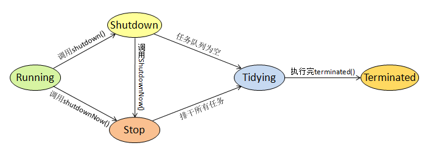

## 1、线程池介绍

### 1.1、什么是线程池？

​        一般而言，对于并发多线程程序，需要频繁的创建线程，而许多线程很短时间内都可以执行完毕，此时会出现一个问题，就是线程的频繁创建与销毁所占用的时间和资源甚至超过了线程本身执行所需的资源。线程池的出现就是为了解决这个问题，解决的关键在于线程的复用。顾名思义，**线程池**就是存放线程的一个池子，需要用到线程时从池子中取线程，用完后归还，并不大量的创建与销毁。

###   1.2、线程池的好处？

在开发过程中，合理地使用线程池能够带来3大好处：

1.  **降低资源消耗**：通过重复利用已创建的线程降低线程创建和销毁造成的消耗。
2.  **提高响应速度**：当任务到达时，任务可以不需要等到线程创建就能立即执行。
3. **提高线程的可管理性**：使用线程池可以进行统一分配、调优和监控。

##  2、线程池的实现原理

当提交一个新任务到线程池时，线程池的处理流程如下：


1.  线程池判断核心线程池里的线程是否都在执行任务。如果不是，则创建一个新的工作线程来执行任务。如果核心线程池里的线程都在执行任务，则进入下个流程。
2. 线程池判断**工作队列**是否已经满了。如果工作队列没有满，则将新提交的任务存储在这个工作队列里。如果工作队列满了，则进入下个流程。
3. 线程池判断线程池的线程是否都处于工作状态。如果没有，则创建一个新的工作线程来执行任务，如果已经满了，则交给**饱和策略**来处理这个任务。     

ThreadPoolExecutor执行execute()方法时示意图：


1. 如果当前运行的线程少于corePoolSize，则创建新线程来执行任务（执行这一步需要获取全局锁）。
2. 如果运行的线程等于或多于corePoolSize，则将任务加入BlockingQueue。
3. 如果无法将任务加入BlockingQueue，则创建新的线程来处理任务。
4. 如果创建新线程将使当前运行的线程超出maximumPoolSize，任务将被拒绝，并调用RejectedExecutionHandler.rejectedExecution()方法。

## 3、线程池的生命周期

​    就像人的生老病死一样，线程池也有自己的生命周期，从创建到终止，线程池在每个阶段所做的事情是不一样的。新建一个线程池时它的状态为Running，这时它不断的从外部接收并处理任务，当处理不过来时它会把任务放到任务队列中；之后我们可能会调用shutdown()来终止线程池，这时线程池的状态从Running转为Shutdown，它开始拒绝接收从外部传过来的任务，但是会继续处理完任务队列中的任务；我们也可能调用shutdownNow()来立刻停止线程池，这时线程池的状态从Running转为Stop，然后它会快速排空任务队列中的任务并转到Tidying状态，处于该状态的线程池需要执行terminated()来做相关的扫尾工作，执行完terminated()之后线程池就转为Terminated状态，表示线程池已终止。这些状态的转换图如下所示。




## 4、如何使用线程池？

### 4.1、核心构造函数

```java
public ThreadPoolExecutor(int corePoolSize, // 1
                              int maximumPoolSize,  // 2
                              long keepAliveTime,  // 3
                              TimeUnit unit,  // 4
                              BlockingQueue<Runnable> workQueue, // 5
                              ThreadFactory threadFactory,  // 6
                              RejectedExecutionHandler handler ) { //7
        if (corePoolSize < 0 ||
            maximumPoolSize <= 0 ||
            maximumPoolSize < corePoolSize ||
            keepAliveTime < 0)
            throw new IllegalArgumentException();
        if (workQueue == null || threadFactory == null || handler == null)
            throw new NullPointerException();
        this.corePoolSize = corePoolSize;
        this.maximumPoolSize = maximumPoolSize;
        this.workQueue = workQueue;
        this.keepAliveTime = unit.toNanos(keepAliveTime);
        this.threadFactory = threadFactory;
        this.handler = handler;
    }
```

| 序号 | 名称            | 类型                     | 含义                                                         |
| :--: | --------------- | ------------------------ | ------------------------------------------------------------ |
|  1   | corePoolSize    | int                      | 核心线程数最大值，默认情况下新建线程池时并不创建线程，后续每接收一个任务就新建一个核心线程来处理，直到核心线程数达到corePoolSize。这时后面到来的任务都会被放到任务队列中等待。 |
|  2   | maximumPoolSize | int                      | 总线程数最大值，当任务队列被放满了之后，将会新建非核心线程来处理后面到来的任务。当总的线程数达到maximumPoolSize后，将不再继续创建线程，而是对后面的任务执行拒绝策略。 |
|  3   | keepAliveTime   | long                     | 闲置线程存活时间，该参数默认情况下只在线程数大于corePoolSize时起作用，闲置线程在任务队列上等待keepAliveTime时间后将会被终止，直到线程数减至corePoolSize。也可以通过设置allowCoreThreadTimeOut变量为true来使得keepAliveTime在任何时候都起作用，这时线程数最后会减至0。 |
|  4   | unit            | TimeUnit                 | 时间单位                                                     |
|  5   | workQueue       | BlockingQueue<Runnable>  | 任务队列，当核心线程数达到corePoolSize后，后面到来的任务都会被放到任务队列中，该任务队列是阻塞队列，工作线程可以通过定时或者阻塞方式从任务队列中获取任务。 |
|  6   | threadFactory   | ThreadFactory            | 线程创建工厂                                                 |
|  7   | handler         | RejectedExecutionHandler | 拒绝策略                                                     |

### 4.2、五种线程池

| 类型                    | 作用                                                         |
| ----------------------- | ------------------------------------------------------------ |
| newSingleThreadExecutor | 一个单线程的线程池，可以用于需要保证顺序执行的场景，并且只有一个线程在执行。 |
| newFixedThreadPool      | 一个固定大小的线程池，可以用于已知并发压力的情况下，对线程数做限制。 |
| newCachedThreadPool     | 一个可以无限扩大的线程池，比较适合处理执行时间比较小的任务。 |
| newScheduledThreadPool  | 可以延时启动，定时启动的线程池，适用于需要多个后台线程执行周期任务的场景。 |
| newWorkStealingPool     | 一个拥有多个任务队列的线程池，可以减少连接数，创建当前可用cpu数量的线程来并行执行。 |

### 4.3、线程池的使用

```java
package com.zte.test.factory;

public class Task implements Runnable{
    private int num;
    public Task(int num) {
        this.num=num;
    }
    @Override
    public void run() {
        System.out.println("正在执行任务  "+num);
        try {
            Thread.currentThread().sleep(4000);
        } catch (InterruptedException e) {
            e.printStackTrace();
        }
        System.out.println("线程"+num+"执行完毕");
    }
}
```

```java
package com.zte.test.factory;

import java.util.concurrent.ArrayBlockingQueue;
import java.util.concurrent.ThreadPoolExecutor;
import java.util.concurrent.TimeUnit;

public class Test4 {
    public static void main(String[] args) {
        ThreadPoolExecutor pool=new ThreadPoolExecutor(5,10,200, TimeUnit.MILLISECONDS,  new ArrayBlockingQueue<Runnable>(5));
        for(int i=0;i<15;i++) {
            Task task=new Task(i);
            pool.execute(task);
            System.out.println("线程池中线程数目："+pool.getPoolSize()+"，队列中等待执行的任务数目："+
                    pool.getQueue().size()+"，已执行玩别的任务数目："+pool.getCompletedTaskCount());
        }
        pool.shutdown();
    }
}
```

```java
正在执行任务  0
线程池中线程数目：1，队列中等待执行的任务数目：0，已执行玩别的任务数目：0
线程池中线程数目：2，队列中等待执行的任务数目：0，已执行玩别的任务数目：0
线程池中线程数目：3，队列中等待执行的任务数目：0，已执行玩别的任务数目：0
正在执行任务  1
正在执行任务  2
线程池中线程数目：4，队列中等待执行的任务数目：0，已执行玩别的任务数目：0
正在执行任务  3
线程池中线程数目：5，队列中等待执行的任务数目：0，已执行玩别的任务数目：0
线程池中线程数目：5，队列中等待执行的任务数目：1，已执行玩别的任务数目：0
正在执行任务  4
线程池中线程数目：5，队列中等待执行的任务数目：2，已执行玩别的任务数目：0
线程池中线程数目：5，队列中等待执行的任务数目：3，已执行玩别的任务数目：0
线程池中线程数目：5，队列中等待执行的任务数目：4，已执行玩别的任务数目：0
线程池中线程数目：5，队列中等待执行的任务数目：5，已执行玩别的任务数目：0
线程池中线程数目：6，队列中等待执行的任务数目：5，已执行玩别的任务数目：0
正在执行任务  10
线程池中线程数目：7，队列中等待执行的任务数目：5，已执行玩别的任务数目：0
正在执行任务  11
线程池中线程数目：8，队列中等待执行的任务数目：5，已执行玩别的任务数目：0
正在执行任务  12
线程池中线程数目：9，队列中等待执行的任务数目：5，已执行玩别的任务数目：0
正在执行任务  13
线程池中线程数目：10，队列中等待执行的任务数目：5，已执行玩别的任务数目：0
正在执行任务  14
线程2执行完毕
线程1执行完毕
线程4执行完毕
线程3执行完毕
正在执行任务  8
线程0执行完毕
正在执行任务  9
正在执行任务  7
正在执行任务  6
正在执行任务  5
线程12执行完毕
线程13执行完毕
线程11执行完毕
线程10执行完毕
线程14执行完毕
线程7执行完毕
线程9执行完毕
线程8执行完毕
线程5执行完毕
线程6执行完毕
```

## 5、参考资料

1、<https://www.jianshu.com/p/f030aa5d7a28>

2、<https://www.cnblogs.com/liuyun1995/p/9305273.html>

3、<https://www.cnblogs.com/zzuli/p/9386463.html>
