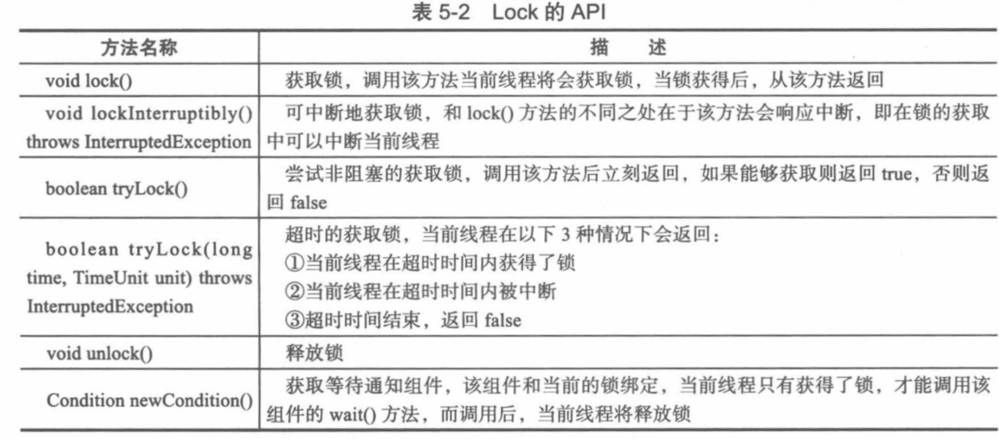

## 1、Lock接口

​    Java SE5之后，并发包新增了Lock接口用来实现锁的功能，它提供了synchronize关键字类似的同步功能，只是在使用时需要显式地获取和释放锁。**虽然它缺少了synchronized的隐式获取释放锁的便捷性，但是却拥有了锁获取与释放的可操作性、可中断的获取锁以及超时锁等多种synchronized不具备的同步特性**。





## 2、队列同步器

​     队列同步器AbstractQueuedSynchronizer，是用来构建锁或者其他同步组件的基础框架，**它使用了一个int成员变量表示同步状态，通过内置的FIFO队列来完成资源获取线程的排队工作**。同步器是面向锁的实现者，它简化了锁的实现方式，屏蔽了同步状态管理、线程排队、等待与唤醒等底层操作。

   同步器提供的方法如下：
- getState()：获取当前同步状态。
- setState()：设置当前同步状态。
- compareAndSetState(int expect,int update)：使用CAS设置当前状态，该方法能够保证状态设置的原子性。

## 3、重入锁

   重入锁ReentrantLock，表示该锁能够支持一个线程对资源的重复加锁。

###   3.1、公平锁和非公平锁

​     公平锁表示线程获取锁的顺序是按照线程请求锁的时间早晚来决定的，也就是最早请求锁的线程将最早获取到锁。而非公平锁则在运行时闯入，不一定先到先得。ReentrantLock提供了公平锁和非公平锁的实现：

```java
公平锁：ReentrantLock pairLock=new ReentrantLock(true)
非公平锁：ReentrantLock pairLock=new ReentrantLock(false)
```

## 4、读写锁

​    synchronized和ReentrantLock都是排他锁，这些锁在同一时刻只允许一个线程进行访问，而读写锁在同一时刻可以允许多个读线程访问，但是在写线程访问时，所有的读线程和其他写线程均被阻塞。**读写锁维护了一对锁，一个读锁和一个写锁，通过读锁和写锁，使得并发性相比一般的排他锁有了很大提升**。


## 5、乐观锁和悲观锁

​     **悲观锁**总是假设最坏的情况，每次去拿数据的时候都认为别人会修改，所以每次在拿数据的时候都会上锁，这样别人想拿这个数据就会阻塞直到它拿到锁（共享资源每次只给一个线程使用，其它线程阻塞，用完后再把资源转让给其它线程）。传统的关系型数据库里边就用到了很多这种锁机制，比如行锁，表锁等，读锁，写锁等，都是在做操作之前先上锁。Java中synchronized和ReentrantLock等独占锁就是悲观锁思想的实现。

​     **乐观锁**总是假设最好的情况，每次去拿数据的时候都认为别人不会修改，所以不会上锁，但是在更新的时候会判断一下在此期间别人有没有去更新这个数据，可以使用版本号机制和CAS算法实现。**乐观锁适用于多读的应用类型，这样可以提高吞吐量** 

## 6、独占锁和共享锁

​     **独占锁**保证任何时候都只有一个线程能得到锁， ReentrantLock 就是以独占方式实现的 。 **共享锁**则可以同时由多个线程持有 ，例如 ReadWriteLock 读写锁，它允许一个资源可以被多线程同时进行读操作 。独占锁是一种悲观锁，由于每次访问资源都先加上互斥锁，这限制了并发性，因为读操作并不会影响数据的一致性，而独占锁只允许在同一时间由 一个线程读取数据，其他线程必须等待当前线程释放锁才能进行读取 。**共享锁则是一种乐观锁，它放宽了加锁的条件，允许多个线程同时进行读操作** 。  

## 7、LockSupport工具

当需要阻塞或唤醒一个线程的时候，都会使用LockSupport工具类来完成相应的工作。


## 8、参考资料

1、《并发编程的艺术》

2、《并发编程之美》


